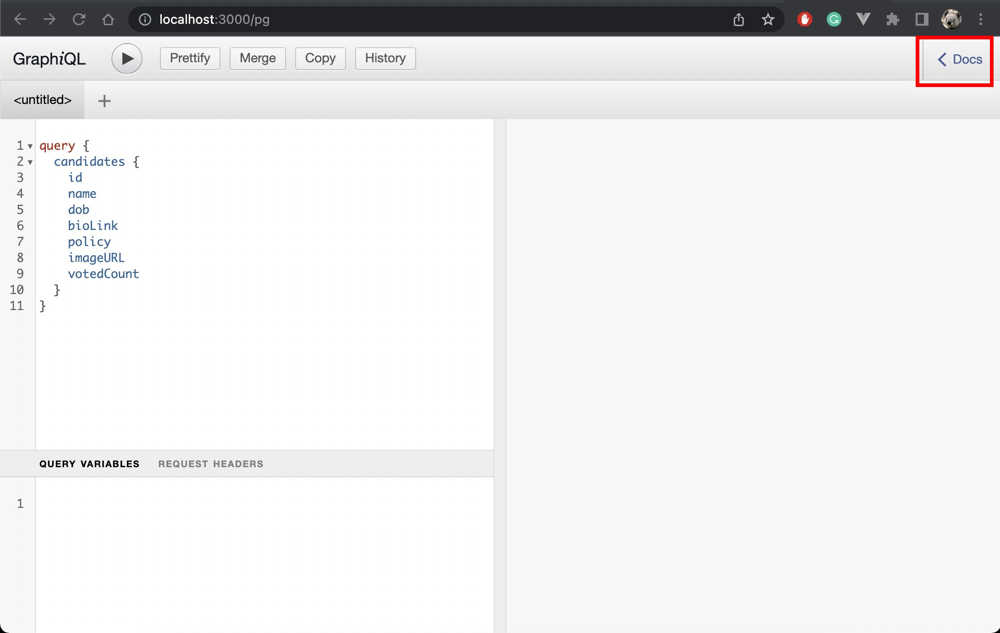

## Election API

### How to run with docker-compose

`$ docker-compose up`

### How to run on local

- Run redis. you can run it via docker `$ make local-redis`.
- Copy .env.example and edit it according to your redis server.
- `$ make run`

After you running API you can access playground via [http:/localhost:8080/pg](http:/localhost:8080/pg)

### Normal flow
You have to open an election with mutaion `open` then you can `vote` with your valid IDCard.

### Example curl

Retrieve all candidates
```
curl 'http://localhost:3000/query' \
  -H 'accept: application/json, multipart/mixed' \
  -H 'content-type: application/json' \
  --data-raw '{"query":"query {\n  candidates {\n    id\n    name\n    dob\n    bioLink\n    policy\n    imageURL\n    votedCount\n  }\n}","variables":null}' \
  --compressed
```
Vote
```
curl 'http://localhost:3000/query' \
  -H 'Authorization: 1234567890121' \
  -H 'accept: application/json, multipart/mixed' \
  -H 'content-type: application/json' \
  --data-raw '{"query":"mutation {\n  vote(id:\"1\")\n}","variables":null}' \
  --compressed
```


### How to access GraphiQL document
- open [http:/localhost:3000/pg](http:/localhost:3000/pg)
- click on the top right `< Docs` as show in picture below 

